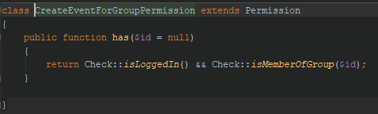

# EventLAB Software Architecture Documentation
**Version 1.0**

## Table of Contents

[1. Introduction](#1-introduction) 
&emsp; [1.1 Purpose](#11-purpose) 
&emsp; [1.2 Scope](#12-scope) 
&emsp; [1.3 Definitions, Acronyms, and Abbreviations](#13-definitions-acronyms-and-abbreviations) 
&emsp; [1.4 References](#14-references) 
&emsp; [1.5 Overview](#15-overview)

[2. Architectural Representation](#2-architectural-representation) 

[3. Architectural Goals and Constraints](#3-architectural-goals-and-constraints) 

[4. Use-Case View](#4-use-case-view) 

[5. Logical View](#5-logical-view) 
&emsp; [5.1 Overview](#51-overview) 
&emsp; [5.2 Architecturally Significant Design Packages](#52-architecturally-significant-design-packages) 

[6. Process View](#6-process-view) 

[7. Deployment View](#7-deployment-view) 

[8. Implementation View](#8-implementation-view) 
&emsp; [8.1 Overview](#81-overview) 
&emsp; [8.2 Layers](#82-layers) 

[9. Data View](#9-data-view) 

[10. Size and Performance](#10-size-and-performance) 

[11. Quality](#11-quality) 

[12. Design Patterns](#11-design-patterns) 

# Software Architecture Documentation

## 1. Introduction

### 1.1 Purpose
This document provides a comprehensive architectural overview of the system, using a number of architectural views to depict different aspects of the system. It is intended to capture and convey the significant architectural decisions which have been made on the system.
### 1.2 Scope
This document describes the architecture of the EventLAB application including all necessary infrastructure.
### 1.3 Definitions, Acronyms, and Abbreviations

| **Abbreviation** | |
| --- | --- |
| MVC | Model View Controller |
| N/A | Not applicable |
| UC | Use Case |

| **Definition** | |
| --- | -- |
| Software Architecture Document | A document that defines the architectural requirements and specifications of a certain software application |

### 1.4 References
| **Title** | **Date** | **Publishing Organization** |
| --- | --- | --- |
| [EventLAB Blog](https://eventlab.jupiterspace.de/) | 2018-10-19 | EventLAB Team |
| [GitHub Source Code](https://github.com/tarjmp/eventlab) | 2018-10-19 | EventLAB Team |
| [GitHub Documentation](https://github.com/tarjmp/eventlab-doc) | 2018-10-19 | EventLAB Team |
| [Production Site](https://eventlab-project.herokuapp.com/) | 2018-10-19 | EventLAB Team |
| [Software Requirements Specification](../Software%20Requirements%20Specification/Software%20Requirements%20Specification.md) | 2018-10-19 | EventLAB Team |

### 1.5 Overview
All necessary architectural details will be described in the following sections. This includes a database diagram, which gives an overview about the project structure. Furthermore, the architectural representation, goals and constraints are clarified in this document.

## 2. Architectural Representation
As this project makes use of the Laravel framework, it is using the following MVC architecture:

The  system is running on a web server that is directly connected to the database server.

## 3. Architectural Goals and Constraints

As described, Laravel uses a Model-View-Controller architecture. This should lead to a clear distinction between data, logic and views.

The Laravel framework does also improve code security. Due to the clear separation between user input and internal commands, the risk of attacks like SQL injections and cross-site scripting should be decreased to a minimum.

## 4. Use-Case View
Below, you can find the overall use case diagram that shows all use cases the application should provide.

## 5. Logical View
### 5.1 Overview
The following section gives an overview about the logical structure of how the application is implemented. The strict rules regarding the MVC architecture should provide the necessary separation between functional logic and user interface design.
### 5.2 Architecturally Significant Design Packages
The class diagram below shows the separation between the three components, i.e. Models, Views and Controllers:

*(Click image for full size)*

## 6. Process View
N/A
## 7. Deployment View

## 8. Implementation View
### 8.1 Overview
N/A
### 8.2 Layers
N/A
## 9. Data View
The auto-generated database diagram below shows the entities with all their attributes that are needed for the application to work. The diagram also provides an overview of the foreign key relationships between the tables.

*(Click image for full size)*

## 10. Size and Performance
The performance of the application will be affected by the number of users accessing the application, as this will increase the number of events, notifications, subscriptions, etc. As everything needs to be stored in the database, this might lead to longer response times and will have an impact on the user experience.

Nevertheless, the application should be able to handle the currently expected number of users. In case any performance issues are detected, the hosting plan can be upgraded at any time to provide enough (database) server capacity.

## 11. Quality
We are using Travis CI as a continuous integration tool to ensure a high quality of our development process. Whenever there is a new commit to any branch, Cucumber tests and PHP unit tests are executed automatically. Pull requests to the production (master) branch must not be permitted until all required tests have passed successfully to ensure a working application at any time.

Additionally, the application must be developed to provide the best possible security. Released code needs to be checked regularly regarding the following types of attack:

- SQL injections
- Cross-site scripting (XSS)
- Cross-site request forgery (CSRF)

Furthermore, the PHP source code of the application must follow the [PSR2 Coding Style Guide](https://www.php-fig.org/psr/psr-2/) to guarantee readability and one style of code written by multiple authors.

## 12. Design Patterns

Design patterns are the answer of typical problems in software design. They are like blueprints that can be customized to solve a particular design problem in the code. Using different design patterns can prevent issues which can cause major problems and improves the code in different ways, like:
<ul>
<li> readability
<li> less complexity
<li> clarity
<li> ....
</ul>

There are different methods for using design patterns. In our case we decided to implement the "Factory Method".

<h5> Factory Method </h5>
The idea of this method is to define an interface for creating objects and delegate that to different sub classes. Goal is that the client doesn't get in touch with the instatiation of objects and only knows the interface. The "creation code" is differentiated from the client.

The results we got after using the factory method as design pattern can be seen in the following pictures:

Class diagram after refactoring: The Permission class is made abstract and instantiated by the PermissionFactory. Each individual permission got its own subclass which extends Permission.

Newly created abstract class “Permission”.

Implementation of the abstract class above.
