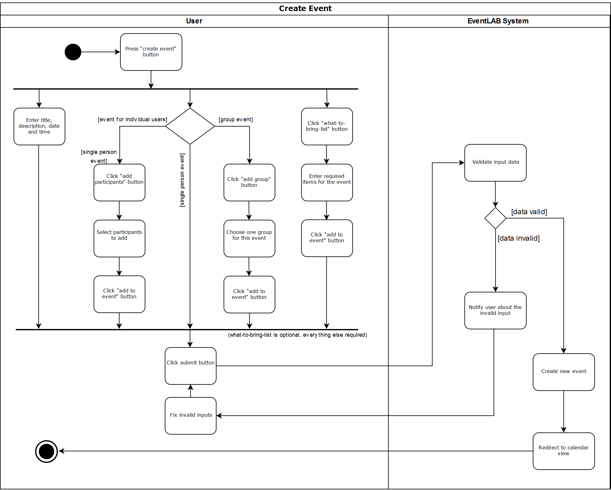

# Use-Case Specification: CRUD Event
#### EventLAB

*Version 1.0*

---
## Table of Contents

&emsp; [1. CRUD Event](#1-crud-event) 
&emsp;&emsp; [1.1 Brief Description](#11-brief-description) 
&emsp; [2. Flow of Events](#2-flow-of-events) 
&emsp;&emsp; [2.1 Basic Flow](#21-basic-flow) 
&emsp;&emsp;&emsp; [2.1.1 Activity Diagram](#211-activity-diagram) 
&emsp;&emsp;&emsp; [2.1.2 Mockup](#212-mockup) 
&emsp;&emsp; [2.2 Alternative Flows](#22-alternative-flows) 
&emsp; [3. Special Requirements](#3-special-requirements) 
&emsp; [4. Preconditions](#4-preconditions) 
&emsp; [5. Postconditions](#5-postconditions) 
&emsp; [6. Extension Points](#6-extension-points) 

## 1. CRUD Event

### 1.1 Brief Description

The purpose of this use case is to create, read, update and delete an event. 
Any user can create an event for any time in the future. The event can be an all-day event or take place at a specific time. An event requires a title, description, date and duration.
All details of the event can be read by all group members. If the group is public the informations about title, description, date and duration can also be seen by guests or users that don't belong to the group.
The group members are allowed to update all parts of the event.
Only the user who created the event can delete it.

## 2. Flow of Events

### 2.1 Basic Flow

##### Create Event
1. A user creates a new event by clicking the "Create event" button on his calendar page.
2. He fills in the required title, date and description of the event.
3. The user decides whether to add a group or individual users to the event.
  - If the user wants to invite individual users, he clicks on "Add participants" and selects the desired participants from the list. Afterwards, the user clicks on "Add to event".
  - If the user wants to make this a group event, he clicks on "Add group" and selects the desired group from the list. Afterwards, the user clicks on "Add to event".
  - If the user wants to create an event for himself and invite nobody, he simply does neither of the steps mentioned above.
4. Optionally, the user can add items to the what-to-bring-list by clicking on "Add what-to-bring-list".
5. The user creates the event by clicking on the submit button.
6. The event is created and added to the calendars of the affected users or group.
7. The user is redirected to his private calendar where he can see the event.

##### Read Event
1. A user navigates to the event details by clicking on the event at his calender page or to a calender of a different (public) group.
2. He can display all the information about the even for e.g. title, description and date.
3. To show the members of the group or the participants he has to click on the arrow button next to the group/participants.
4. To see the entries in the What-To-Bring-List he has to click on the arrow button next to it.
5. The user navigates back to the calendar page.

##### Update Event
1. A user navigates to the event details by clicking on the event at his calender page.
2. To edit the Event he has to click on the edit button.
3. The user is able to change the event name, the description, the date, the group and the What-To-Bring-List.
4. To save the changes he has to click on the ok button.
5. The user is redirected to his private calendar where he can see the his changed event.

##### Delete Event
1. A user navigates to the event details by clicking on the event at his calender page.
2. To edit the Event he has to click on the edit button.
3. The user has to click on the dustbin button to delete the event.
4. The user is redirected to his private calendar where he can see that the event is deleted.

#### 2.1.1 Activity Diagram

##### CRUD Event
##### Create Event

##### Read Event
##### Update Event
##### Delete Event

#### 2.1.2 Mockup

##### Create Event

##### Read Event 
[![Mockup 2] (Mockups/Read_Event/02%20-%20Event%20Detail%20Site.png)](https://github.com/tarjmp/eventlab-doc/tree/master/Software%20Requirements%20Specification/Use%20Cases/CRUD%20Event/Mockups/Read_Event)

##### Update Event
[![Mockup 3] (Mockups/Update_Event/03%20-%20Edit%20Event.png)](https://github.com/tarjmp/eventlab-doc/tree/master/Software%20Requirements%20Specification/Use%20Cases/CRUD%20Event/Mockups/Update_Event)

##### Delete Event
[![Mockup 4] (Mockups/Delete_Event/04%20-%20Edit%20Event.png)](https://github.com/tarjmp/eventlab-doc/tree/master/Software%20Requirements%20Specification/Use%20Cases/CRUD%20Event/Mockups/Delete_Event)

### 2.2 Alternative Flows

n/a

## 3. Special Requirements

This use case can be perfomed by users and partly by guests. Generally a guest can only display the events of public groups and than only the title, description, date and duration. The What-To-Bring-List and the members are private. The same applies to an user which is not subscribed to the group. The members of the group can show and update their events unrestricted.
Only the user who created the event is allowed to delete it.

## 4. Preconditions

### Create-, Update-, Delete Event
The user must be on his his personal calendar page.

### Read Event
The user must be on his personal calendar page or from a different (public) group.

## 5. Postconditions

### Create Event
The new event has been created and appears in all the affected calendars.

### Read Event 
The details of the event are shown on the website.

### Update Event
The event has been updated in all the affected calendars.

### Delete Event
The event has been deleted in all the affected calendars.

## 6. Extension Points

n/a
