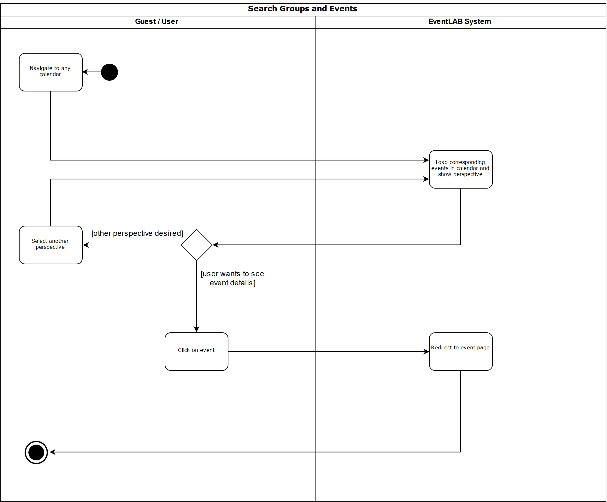

# Use-Case Specification: Display Calendar
#### EventLAB

*Version 1.0*

---
## Table of Contents

&emsp; [1. Display Calendar](#1-display-calendar) 
&emsp;&emsp; [1.1 Brief Description](#11-brief-description) 
&emsp; [2. Flow of Events](#2-flow-of-events) 
&emsp;&emsp; [2.1 Basic Flow](#21-basic-flow) 
&emsp;&emsp;&emsp; [2.1.1 Activity Diagram](#211-activity-diagram) 
&emsp;&emsp;&emsp; [2.1.2 Mockup](#212-mockup) 
&emsp;&emsp; [2.2 Alternative Flows](#22-alternative-flows) 
&emsp; [3. Special Requirements](#3-special-requirements) 
&emsp; [4. Preconditions](#4-preconditions) 
&emsp; [5. Postconditions](#5-postconditions) 
&emsp; [6. Extension Points](#6-extension-points) 

## 1. Display Calendar

### 1.1 Brief Description

The purpose of this use case is to view a certain calendar. This can be the calendar of any public group. Logged-in users can also display the calendar of a group they are a member of, as well as their own personal calendar.

Each calendar view shows the events in the selected time frame, arranged chronologically. As this use case is one of the main functionalities of the EventLAB application, we provide different views to allow a detailed event planning:

| Perspective | Description |
| --- | --- |
| Month | All events in one month, arranged in a grid layout |
| Week | All events within one week |
| Day | All events for one specific day |
| Next events | The next upcoming events in chronological order |

## 2. Flow of Events

### 2.1 Basic Flow

1. The user or guest must have navigated to a calendar, see section [Preconditions](#4-preconditions).
2. The default perspective is loaded and displayed.
3. The user or guest clicks any of the options to toggle the perspective.
4. The new perspective is loaded and displayed.
5. Steps 3 and 4 can be repeated as often as desired.

#### 2.1.1 Activity Diagram

#### 2.1.2 Mockup

##### Month Perspective

##### Week Perspective

##### Day Perspective

##### "Next Events" Perspective

### 2.2 Alternative Flows

n/a

## 3. Special Requirements

This use case can be perfomed by users and guests.

## 4. Preconditions

There are multiple ways to display a certain calendar. The user or guest can navigate to a group by using the search functionality described in [this use case](../Search%20Groups%20and%20Events/UC-Specification-Search-Groups-and-Events.md).

## 5. Postconditions

The user or guest can click on any event shown in the calendar for further details.

## 6. Extension Points

n/a
