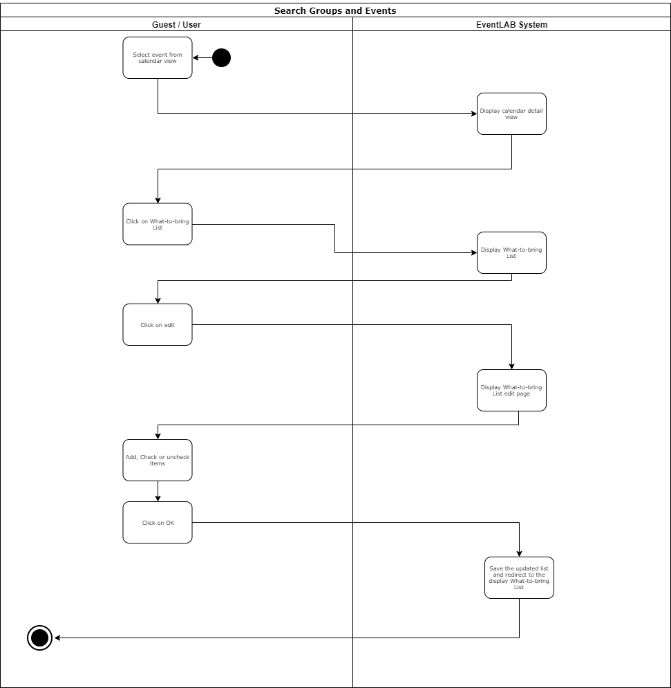
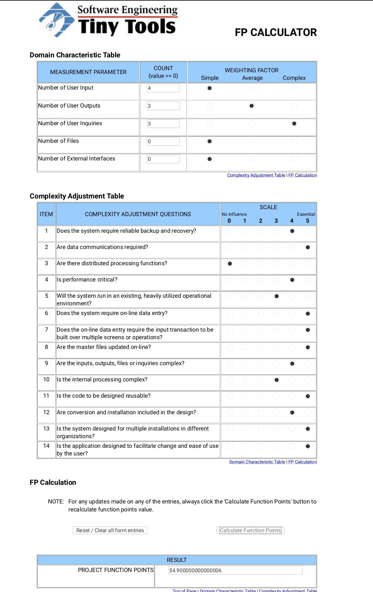

# Use-Case Specification: Edit What-to-bring List
#### EventLAB

*Version 1.0*

---
## Table of Contents

&emsp; [1. Edit What-to-bring List](#1-edit-what-to-bring-list) 
&emsp;&emsp; [1.1 Brief Description](#11-brief-description) 
&emsp; [2. Flow of Events](#2-flow-of-events) 
&emsp;&emsp; [2.1 Basic Flow](#21-basic-flow) 
&emsp;&emsp;&emsp; [2.1.1 Activity Diagram](#211-activity-diagram) 
&emsp;&emsp;&emsp; [2.1.2 Mockup](#212-mockup) 
&emsp;&emsp; [2.2 Alternative Flows](#22-alternative-flows) 
&emsp; [3. Special Requirements](#3-special-requirements) 
&emsp; [4. Preconditions](#4-preconditions) 
&emsp; [5. Postconditions](#5-postconditions) 
&emsp; [6. Extension Points](#6-extension-points) 

## 1. Edit What-to-bring List

### 1.1 Brief Description
The purpose of this use case is to edit the what to bring list for an event. The user can put items on the list, delete items from the list and check one or more items from the list stating that he will bring this item to the party. Every participant of this event can contribute to the event making an extra communication channel to organize these contributions unnecessary.

## 2. Flow of Events

### 2.1 Basic Flow

1.	A user wants to edit the what to bring list for a specific event.
2.	The user selects the event from his personal calendar.
3.	He inserts, deletes or selects an item in this list.
4.	He clicks on the ok button at the bottom of the page to save the changes.

#### 2.1.1 Activity Diagram

#### 2.1.2 Mockup

##### User interface showing the calendar page

##### User interface showing the event detail page

##### User interface showing the What-to-bring List

##### User interface for editing the What-to-bring List

### 2.2 Alternative Flows

n/a

## 3. Special Requirements

This use case can only be performed by user and not by guests because guests can not accept events. Therefore, they cannot edit this list.

## 4. Preconditions

The user must be logged in.

## 5. Postconditions

### User added an item to the list
The What-to-bring list now contains the item added to the list.

### User removed an item from the list
The What-to-bring list now is not containing the deleted item any more.

### User checked an item from the list
The item is now checked for every participant from the event.

## 6. Extension Points

To calulate the function points for a specific use case we used the [TINY TOOLS FP Calculator](http://groups.umd.umich.edu/cis/course.des/cis525/js/f00/harvey/FP_Calc.html).

    Score:      55 Function Points
    Time spent: 0 m
	

