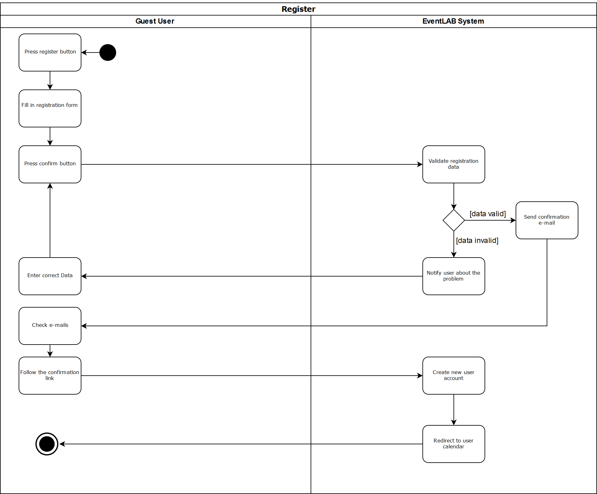
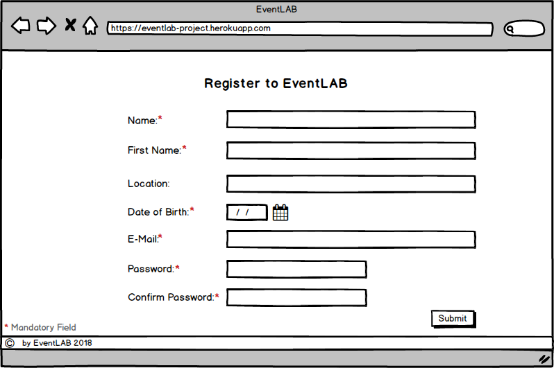
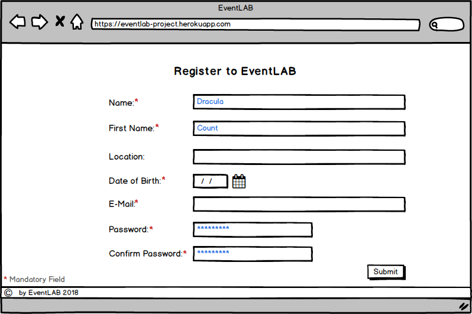
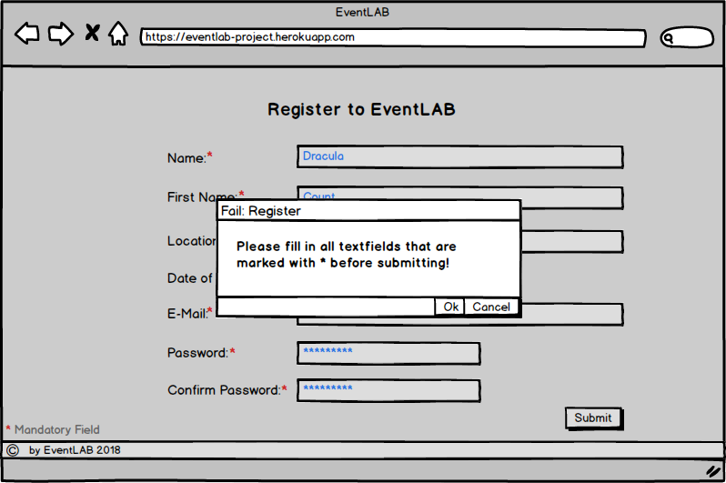
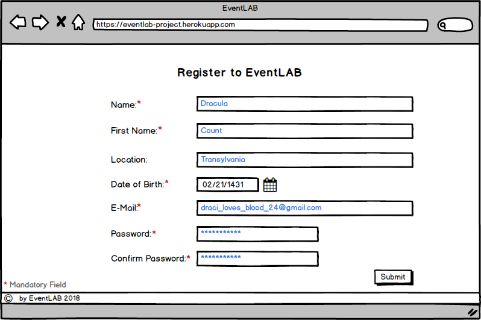
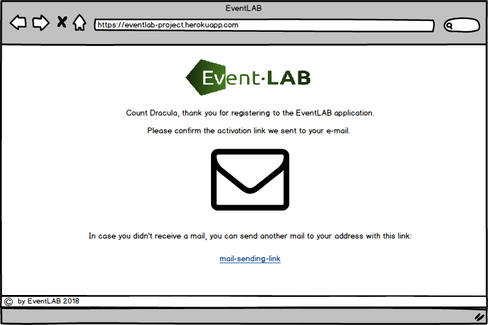
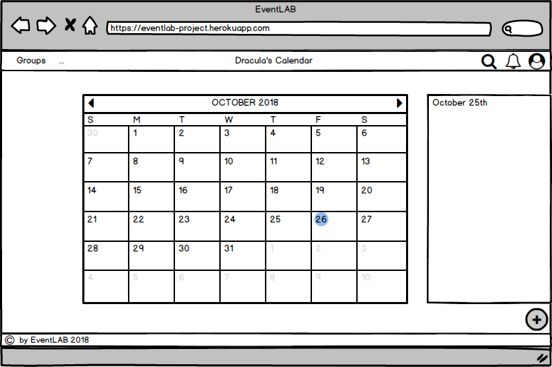

# Use-Case Specification: Register
#### EventLAB

*Version 1.0*

---
## Table of Contents

&emsp; [1. Register](#1-register) 
&emsp;&emsp; [1.1 Brief Description](#11-brief-description) 
&emsp; [2. Flow of Events](#2-flow-of-events) 
&emsp;&emsp; [2.1 Basic Flow](#21-basic-flow) 
&emsp;&emsp;&emsp; [2.1.1 Activity Diagram](#211-activity-diagram) 
&emsp;&emsp;&emsp; [2.1.2 Mockups](#212-mockups) 
&emsp;&emsp; [2.2 Alternative Flows](#22-alternative-flows) 
&emsp;&emsp;&emsp; [2.2.1 Request New Confirmation E-Mail](#221-request-new-confirmation-e-mail) 
&emsp; [3. Special Requirements](#3-special-requirements) 
&emsp; [4. Preconditions](#4-preconditions) 
&emsp; [5. Postconditions](#5-postconditions) 
&emsp; [6. Extension Points](#6-extension-points) 

## 1. Register

### 1.1 Brief Description

The purpose of this use case is to create a new user account to allow any person to register to the application.

## 2. Flow of Events
### 2.1 Basic Flow
1. A guest enters the registration process by clicking the "Register" button on any page.
2. He fills in the required user data and transmits it via a click on the submit button.
3. The server checks the provided data and continues only on valid inputs. The user is asked to correct the data otherwise.
3. An automatic e-mail message is generated and sent by the system to verify the provided e-mail address.
4. The guest opens the e-mail and follows the activation link in the message.
5. A new user account is created and a new private calendar is set up for the user.
6. The user gets logged in and redirected to his user calendar.

#### 2.1.1 Activity Diagram

#### 2.1.2 Mockups
##### Register Screen

##### Registration fails

##### Registration Screen filled in

##### Confirmation Mail Screen

##### User Calendar

### 2.2 Alternative Flows

#### 2.2.1 Request New Confirmation E-Mail

The user might not receive a confirmation e-mail due to spam filters, technical issues, etc... In this case, he can request another one by simply clicking on the "send confirmation e-mail" link provided in the application.

 This will resend the same confirmation e-mail and will not affect the validity of the previous confirmation link.

## 3. Special Requirements
The guest must have a valid e-mail address and must be able to receive and open messages sent to this address.

## 4. Preconditions
The application is accessed via a guest account, so the user must not be logged in.

## 5. Postconditions
n/a

## 6. Extension Points
n/a
