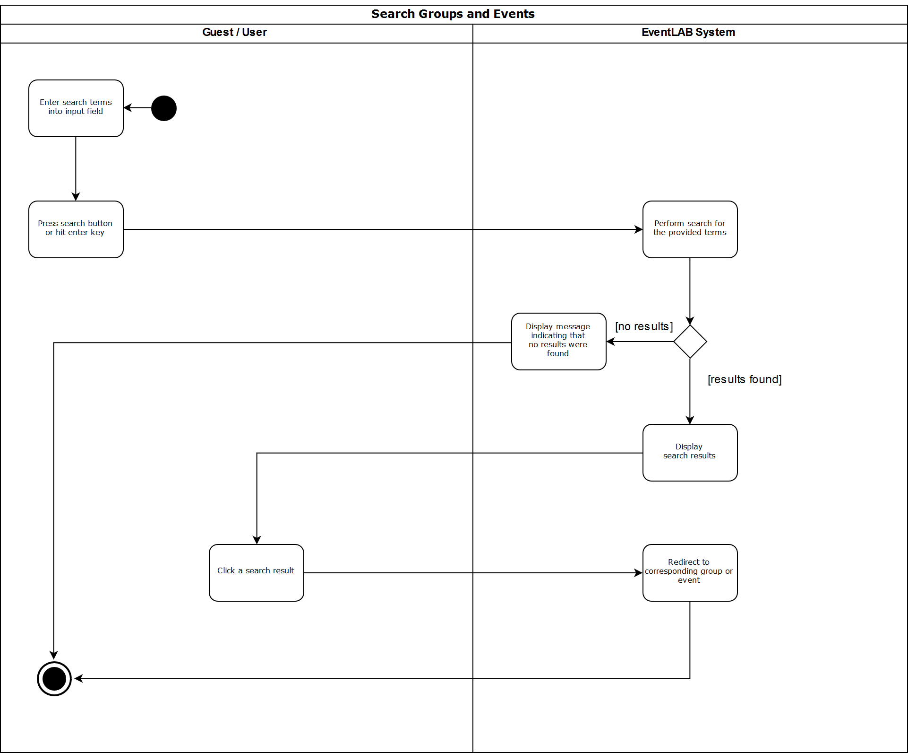
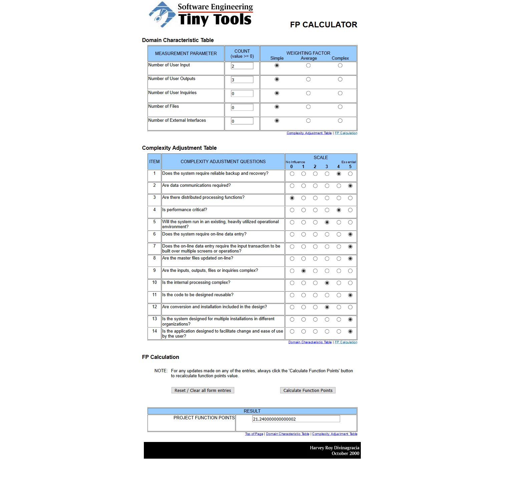

# Use-Case Specification: Search Groups and Events
#### EventLAB

*Version 1.0*

---
## Table of Contents

&emsp; [1. Search Groups and Events](#1-search-groups-and-events) 
&emsp;&emsp; [1.1 Brief Description](#11-brief-description) 
&emsp; [2. Flow of Events](#2-flow-of-events) 
&emsp;&emsp; [2.1 Basic Flow](#21-basic-flow) 
&emsp;&emsp;&emsp; [2.1.1 Activity Diagram](#211-activity-diagram) 
&emsp;&emsp;&emsp; [2.1.2 Mockups](#212-mockups) 
&emsp;&emsp; [2.2 Alternative Flows](#22-alternative-flows) 
&emsp;&emsp;&emsp; [2.2.1 No Search Results](#221-no-search-results) 
&emsp;&emsp;&emsp; [2.2.2 Mockups](#222-mockups) 
&emsp; [3. Special Requirements](#3-special-requirements) 
&emsp; [4. Preconditions](#4-preconditions) 
&emsp; [5. Postconditions](#5-postconditions) 
&emsp; [6. Extension Points](#6-extension-points) 

## 1. Search Groups and Events

### 1.1 Brief Description

The purpose of this use case is to provide a helpful search functionality to users and guests, so that events and groups can be found quickly.

## 2. Flow of Events
### 2.1 Basic Flow
1. A guest or user types the desired search terms into the search field in the navigation bar.
2. He hits *Enter* or clicks the search button next to the icon.
3. The server performs an automatic search for groups and events matching the requested terms.
4. The user is redirected to a page showing the search results.
5. The user clicks a search result.
6. He is redirected to the corresponding group or event.

#### 2.1.1 Activity Diagram

#### 2.1.2 Mockups
##### Search Input

##### Successful Search

### 2.2 Alternative Flows

#### 2.2.1 No Search Results
If there are no groups or events that match the search criteria, a notification screen is shown to the user. There, he can decide to alter the search terms or go back to the previous page.

#### 2.2.2 Mockups

## 3. Special Requirements
The search can be performed by guests and logged-in users, so there are no special requirements to this action. Of course, the search results may differ depending on whether a user is logged in, as some groups and events cannot be accessed by guests.

## 4. Preconditions
n/a

## 5. Postconditions
The user has successfully navigated to the desired event or group and can perform further actions there.

## 6. Extension Points

To calulate the function points for a specific use case we used the [TINY TOOLS FP Calculator](http://groups.umd.umich.edu/cis/course.des/cis525/js/f00/harvey/FP_Calc.html).

    Score:      21,24 Function Points
    Time spent: 49m
	

